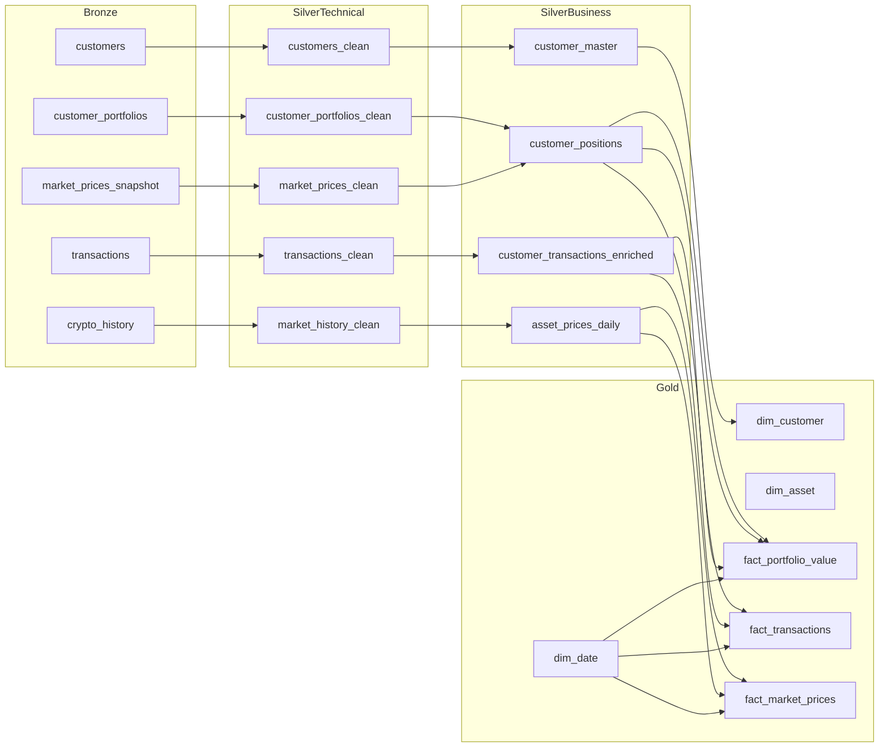

# 📘 **Crypto Investment Platform — End‑to‑End Medallion Architecture on Databricks**

This project implements a complete **Medallion Architecture** (Bronze → Silver → Gold) on Databricks to process, clean, model, and analyze crypto‑investment data.  
It demonstrates real‑world data engineering practices including ingestion, transformation, SCD2 dimensions, fact modeling, and orchestration.

---

# 🏛️ **Architecture Overview**

```
Bronze (raw)
      ↓
Silver Technical (clean)
      ↓
Silver Business (modeled)
      ↓
Gold (dim/fact)
```

---

# 📐 **Architecture Diagram**

```mermaid
flowchart TD

    subgraph Bronze["🟫 Bronze Layer (Raw)"]
        B1[customers]
        B2[customer_portfolios]
        B3[transactions]
        B4[crypto_history]
        B5[market_prices_snapshot]
        B6[assets]
        B7[countries]
        B8[risk_profiles]
        B9[exchange_rates]
        B10[audit_log]
    end

    subgraph SilverTech["🥈 Silver Technical (Clean)"]
        S1[customers_clean]
        S2[customer_portfolios_clean]
        S3[transactions_clean]
        S4[market_history_clean]
        S5[market_prices_clean]
    end

    subgraph SilverBiz["🥈 Silver Business (Modeled)"]
        SB1[customer_master]
        SB2[asset_prices_daily]
        SB3[customer_positions]
        SB4[customer_transactions_enriched]
    end

    subgraph Gold["🥇 Gold Layer (Dim/Fact)"]
        G1[dim_customer (SCD2)]
        G2[dim_asset (SCD2)]
        G3[dim_date]
        G4[fact_portfolio_value]
        G5[fact_transactions]
        G6[fact_market_prices]
    end

    Bronze --> SilverTech
    SilverTech --> SilverBiz
    SilverBiz --> Gold
```

---

# 🗂 **Folder Structure**

```
crypto-investment-platform-pipeline/
│
├── data/
│   └── raw/                     # GitHub CSVs (Bronze source)
│
├── notebooks/
|   ├── bronze
│       ├── 01_bronze_ingestion.py   # Loads GitHub CSVs → Bronze tables
|   ├── silver
│       ├── 02_silver_technical.sql  # Cleans raw → Silver Technical
│       ├── 03_silver_business.sql   # Business modeling → Silver Business
|   ├── gold
│       └── 03_gold_layer.sql        # Dim/Fact creation → Gold
│
├── docs/
│   ├── architecture.md
│   ├── lineage.md
│   └── erd.md
│
├── jobs/
│   └── pipeline_job.json        # Databricks Job definition
│
└── README.md
```

---

# 🟫 **Bronze Layer — Raw Ingestion**

The Bronze layer captures data **exactly as it arrives** from GitHub CSVs, preserving full fidelity for auditability and replay.

**Characteristics:**
- No transformations  
- Schema as‑is  
- Includes duplicates, nulls, inconsistencies  
- Stored as Delta tables  

**Bronze tables:**
- customers  
- customer_portfolios  
- transactions  
- crypto_history  
- market_prices_snapshot  
- assets  
- countries  
- risk_profiles  
- exchange_rates  
- audit_log  

---

# 🥈 **Silver Technical Layer — Cleaned & Standardized**

The Silver Technical layer applies **technical cleaning** to make data consistent and usable.

**Transformations include:**
- Deduplication  
- Type casting  
- Standardized column names  
- Removal of malformed rows  

**Silver Technical tables:**
- customers_clean  
- customer_portfolios_clean  
- transactions_clean  
- market_history_clean  
- market_prices_clean  

---

# 🥈 **Silver Business Layer — Modeled & Enriched**

The Silver Business layer applies **business logic** and domain‑specific transformations.

**Transformations include:**
- Customer enrichment  
- Daily asset price modeling  
- Portfolio valuation  
- Transaction enrichment  
- Derived metrics (returns, volatility flags, position values)  

**Silver Business tables:**
- customer_master  
- asset_prices_daily  
- customer_positions  
- customer_transactions_enriched  

---

# 🥇 **Gold Layer — Dimensional (Dim/Fact)**

The Gold layer provides **analytics‑ready** dimensional models for BI dashboards and reporting.

### **Dimensions**
- `dim_customer` — SCD2 customer dimension  
- `dim_asset` — SCD2 asset dimension  
- `dim_date` — calendar dimension  

### **Facts**
- `fact_portfolio_value` — customer portfolio valuation  
- `fact_transactions` — enriched transaction fact  
- `fact_market_prices` — daily OHLC + returns  

---

# 📚 **Data Dictionary**

## **Bronze Layer**
| Table | Description |
|-------|-------------|
| customers | Raw customer data |
| customer_portfolios | Customer asset holdings |
| transactions | Buy/sell transactions |
| crypto_history | Daily OHLC crypto prices |
| market_prices_snapshot | Latest market snapshot |
| assets | Asset metadata |
| countries | Country metadata |
| risk_profiles | Risk profile definitions |
| exchange_rates | FX rates |
| audit_log | System audit events |

---

## **Silver Technical Layer**
| Table | Description |
|-------|-------------|
| customers_clean | Clean customer data |
| customer_portfolios_clean | Clean portfolio data |
| transactions_clean | Clean transactions |
| market_history_clean | Clean OHLC data |
| market_prices_clean | Clean snapshot prices |

---

## **Silver Business Layer**
| Table | Description |
|-------|-------------|
| customer_master | Enriched customer profile |
| asset_prices_daily | OHLC + returns + volatility |
| customer_positions | Portfolio valuation |
| customer_transactions_enriched | Enriched transactions |

---

## **Gold Layer**
| Table | Type | Description |
|-------|------|-------------|
| dim_customer | SCD2 Dimension | Customer attributes over time |
| dim_asset | SCD2 Dimension | Asset metadata over time |
| dim_date | Dimension | Calendar table |
| fact_portfolio_value | Fact | Portfolio valuation snapshot |
| fact_transactions | Fact | Customer transactions |
| fact_market_prices | Fact | Daily market prices |

---

# 🧩 **Lineage Diagram**



---

# 🚀 **How to Run This Project**

### **1. Clone the repository**
# Replace user with your github user id
```
git clone https://github.com/{user}/crypto-investment-platform-pipeline.git
```

### **2. Import notebooks into Databricks**
Upload the `notebooks/` folder into your workspace.

### **3. Run Bronze ingestion**
Notebook: `01_bronze_ingestion.py`

### **4. Run Silver Technical**
Notebook: `02_silver_technical.sql`

### **5. Run Silver Business**
Notebook: `03_silver_business.sql`

### **6. Run Gold Layer**
Notebook: `03_gold_layer.sql`

### **7. (Optional) Create a Databricks Job**
Add 4 tasks in order:

1. Bronze ingestion  
2. Silver Technical  
3. Silver Business  
4. Gold Layer  

Schedule daily or hourly.

---

# 🎯 **Outcome**

This project delivers:

- A fully automated, production‑grade data pipeline  
- Clean separation of raw, cleaned, modeled, and analytical layers  
- A star schema suitable for BI tools  
- A portfolio‑ready demonstration of real‑world data engineering skills  

--- 

Just tell me what you want to add next.
